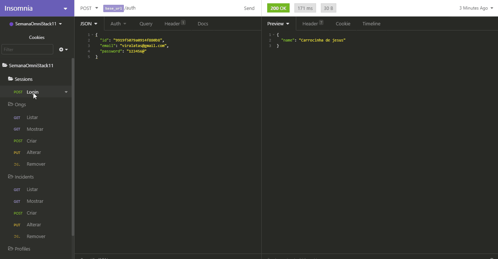
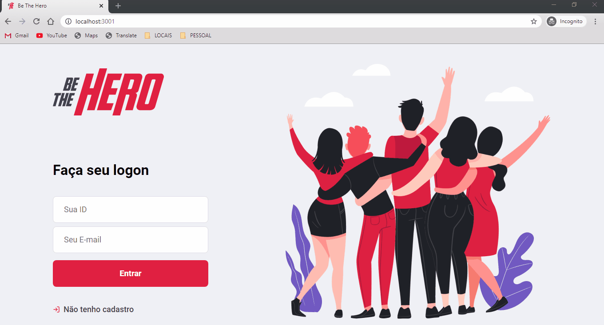
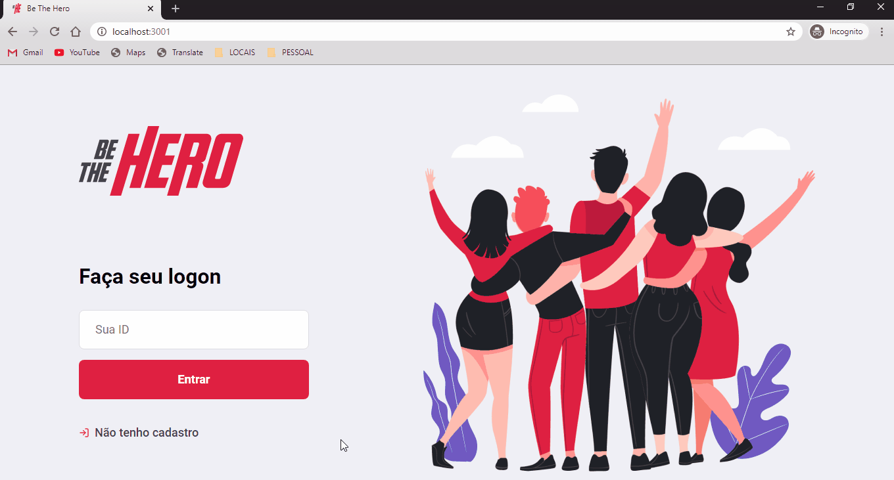
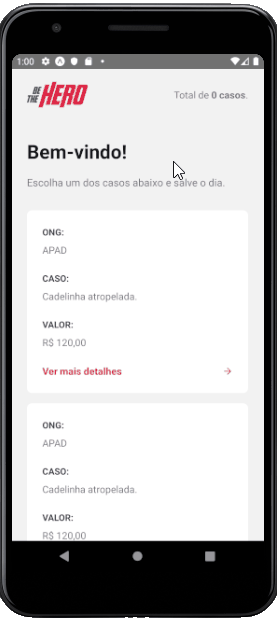

<h1 align="center">
    
</h1>

<p align="center">
  
  
  
  
  
</p>

<p align="center">
  <a href="https://github.com/devluma/semana-omni-stack11/releases">
    
  </a>
  <a href="https://github.com/devluma/semana-omni-stack11/commits/master">
    
  </a>
  <a href="https://github.com/devluma/semana-omni-stack11/issues">
    
  </a>
  <a href="https://github.com/devluma/semana-omni-stack11/archive/master.zip">
    
  </a>
</p>

<p align="center">
  
  <a href="https://github.com/devluma" target="_blank" >
    
  </a>
  <a href="https://www.linkedin.com/in/devluma/" target="_blank" >
    
  </a>
  <a href="mailto:luiz.schmitt@sysdomotic.com.br" target="_blank" >
    
  </a>
</p>

<p align="center">
  <a href="#desafio-proposto">Desafio</a>&nbsp;&nbsp;|&nbsp;&nbsp;
  <a href="#além-do-desafio">Implementações</a>&nbsp;&nbsp;|&nbsp;&nbsp;
  <a href="#-descrição-do-projeto">Descrição do Projeto</a>&nbsp;&nbsp;|&nbsp;&nbsp;
  <a href="#information_source-como-usar">Como Usar</a>&nbsp;&nbsp;|&nbsp;&nbsp;
  <a href="#-contribuições">Contribuições</a>&nbsp;&nbsp;
</p>

<br />

# Projeto `Be The Hero`

Aplicação com intuito de estudar Node.js, ReactJS e React Native. Abordagem utilizada no desafio da Semana OmniStack 11 da [Rocketseat](https://rocketseat.com.br/).

# Desafio proposto!

📌 Criar uma aplicação com intuito de conectar pessoas interessadas em ajudar ONGS e ANIMAIS utilizando a stack proposta ([NodeJS](https://nodejs.org/en/docs/), [ReactJS](https://reactjs.org/docs/getting-started.html) e [React Native](https://reactnative.dev/docs/getting-started) / [Expo](https://docs.expo.io/)).

## Além do desafio!

- ❌ Criar um template Dark utilizando Theme Switcher / [CSS-TRICKS](https://css-tricks.com/a-dark-mode-toggle-with-react-and-themeprovider/)
- ✔️ Criar a Stack ([NodeJS](https://nodejs.org/en/docs/) e [SqLite](https://www.sqlite.org/docs.html/)) no docker para facilitar a criação dos ambientes de desenvolvimento / [DEV-DOCKER](https://github.com/devluma/dev-docker)
- ✔️ Adicionar os pacotes de cada plataforma como sub-módulos do <b>GIT</b> / [GIT-SUB-MODULES](https://git-scm.com/docs/git-submodule/)
- ✔️ Adicionar <b>EditorConfig</b>, <b>Eslint</b> e <b>Prettier</b> para padronizar o código da aplicação / [Dica do DIEGO3G](https://www.youtube.com/watch?v=TI4v4Y8yRjw)
- ✔️ Adicionar animações nos botões, inputs e loading dos formulários / [Animações com CSS3](https://github.com/devluma/animations-css3-examples/)
- ✔️ Adicionar uma rotina para editar as <b>ONGS</b> e os <b>CASOS</b> já cadastrados
- ✔️ Adicionar um componente <b>HEADER</b> na aplicação, com um efeito de <b>Scroll-Over</b> ao rolar a página
- ✔️ Adicionar um componente <b>FOOTER</b> na aplicação, com as informações de <b>Copyright</b> do projeto
- ✔️ Adicionar testes de integração e unitários ao projeto utilizando [JEST](https://jestjs.io/docs/en/getting-started) e [SQLITE](https://www.sqlite.org/docs.html)
- ✔️ Adicionar botões de <b>Login Social</b> na aplicação, utilizando o <b>Google</b>, <b>Facebook</b> e <b>GitHub</b>
- ❌ Adicionar autenticação utilizando o JWT e o Passport / [Dica do LuizTools](https://www.luiztools.com.br/post/autenticacao-json-web-token-jwt-em-nodejs/)
- ✔️ Alterar a animação da navegação do mobile para deixá-la igual a de <b>IOS</b> / [Dica do DevlumaPC03](https://github.com/DevlumaPC03/Be-The-Hero/)
- ❌ Ajustar o aplicativo web para aceitar responsividade
- ❌ Utilizar [Styled-Components](https://styled-components.com/) para estilizar as telas da aplicação
- ❌ Utilizar [@typescript](https://www.typescriptlang.org/) como superset no JavaScript
- ❌ Utilizar o [Sequelize](https://sequelize.org/) como <b>ORM na API</b>.

# 🚢 Descrição do Projeto:

### 👉 Back-end:

A <b>API RESTful</b> foi criada utilizando <b>ExpressJS</b> com <b>Knex</b> e o <b>Insomnia</b> para testar as rotas e autenticação das chamadas na <b>API</b>.

<table>
  <thead>
    <th>
      <b>Consultas no Insomnia:</b>
    </th>
  </thead>
  <tbody>
    <tr>
      <td>
        
      </td>
    </tr>
  </tbody>
</table>

### 👉 Front-end

A <b>Aplicação WEB</b> foi criada utilizando <b>ReactJS</b> com <b>CSS3</b> e <b>Axios</b> para as chamadas na <b>API</b>.

<table>
  <thead>
    <th>
      <b>Tema Normal:</b>
    </th>
  </thead>
  <tbody>
    <tr>
      <td>
        
      </td>
    </tr>
  </tbody>
</table>

<table>
  <thead>
    <th>
      <b>Tema Dark:</b>
    </th>
  </thead>
  <tbody>
    <tr>
      <td>
        
      </td>
    </tr>
  </tbody>
</table>

### 👉 Mobile

A <b>Aplicação MOBILE</b> foi criada utilizando <b>React Native</b> com <b>Expo</b> e <b>Styled-Components</b> para estilizar as telas da aplicação.

<table>
  <thead>
    <th>
      <b>Tema Normal:</b>
    </th>
    <th>
      <b>Tema Dark:</b>
    </th>
  </thead>
  <tbody>
    <tr>
      <td>
        
      </td>
      <td>
        
      </td>
    </tr>
  </tbody>
</table>

### 🔖 Layout

O layout da aplicação está no [Figma](#Layout).

### :information_source: Como Usar

Para clonar e executar este projeto, você precisará do [Git](https://git-scm.com/book/en/v2/Getting-Started-Installing-Git), [NodeJS](https://nodejs.org/en/docs/) + [Yarn](https://yarnpkg.com/) instalados no seu computador.

#### 💻 Executar na Linha de Comando

```bash
# Clone o repositório no diretório desejado
$ git clone https://github.com/devluma/semana-omni-stack11.git

# Vá para o diretório onde o projeto foi clonado
$ cd semana-omni-stack11/htdocs/

# Abrir o projeto no VS Code
$ code .
```

#### 💻 Executar a API

```bash
# Vá para o diretório
$ cd semana-omni-stack11/htdocs/backend/

# Instalar as dependências do node_modules
$ yarn install

# Dependências de desenvolvimento
# $ yarn add babel-eslint @babel/core prettier -D
# $ yarn add eslint eslint-config-airbnb eslint-config-prettier eslint-plugin-import eslint-plugin-jsx-a11y eslint-plugin-prettier eslint-plugin-react eslint-plugin-react-hooks -D

# Execute as migrações para criar o banco de dados
$ yarn knex:migrate

# Execute o comando para popular algumas tabelas
$ yarn knex:seed

# Inicie o servidor
$ yarn dev

# Abra o seu navegador ou o Insomnia e aponte para http://localhost:3001/api/
```

#### 💻 Executar o APP Front-end

```bash
# Vá para o diretório
$ cd semana-omni-stack11/htdocs/frontent/

# Instalar as dependências do node_modules
$ yarn install

# Dependências de desenvolvimento
# $ yarn add babel-eslint @babel/core prettier -D
# $ yarn add eslint eslint-config-airbnb eslint-config-prettier eslint-plugin-import eslint-plugin-jsx-a11y eslint-plugin-prettier eslint-plugin-react eslint-plugin-react-hooks -D

# Execute o projeto
$ yarn start

# Abra o seu navegador no endereço http://localhost:3000/
```

#### 💻 Executar o APP Mobile

```bash
# Vá para o diretório
$ cd semana-omni-stack11/htdocs/mobile/

# Instalar as dependências do node_modules
$ yarn install

# Dependências de desenvolvimento
# $ yarn add babel-eslint babel-preset-expo @babel/core prettier -D
# $ yarn add eslint eslint-config-airbnb eslint-config-prettier eslint-plugin-import eslint-plugin-jsx-a11y eslint-plugin-prettier eslint-plugin-react eslint-plugin-react-hooks -D

# Execute o projeto
$ yarn start

# O Expo será aberto, e basta digitalizar o qrcode no terminal ou abrir na página da exposição

# Se você tiver algum problemas com os fontes do projeto, execute:
#$ expo install expo-font @expo-google-fonts/ubuntu @expo-google-fonts/roboto

# Dependências do Expo
#$ expo install expo-mail-composer expo-constants @expo/vector-icons

```

#### 💻 Executando com o DOCKER

```bash
# Vá para o diretório
$ cd semana-omni-stack11/docker/

# Execute a stack do projeto
$ docker-compose up nodejs sqlite3 -d --build

# Abra o seu navegador no(s) endereço(s):
# ---
# WEB: http://app.local
# API: http://api.local
```

# 🚀 Tecnologia(s) Utilizada(s) no Projeto

<table>
  <thead>
    <th>Back-end</th>
    <th>Front-end</th>
    <th>Mobile</th>
  </thead>
  <tbody>
    <tr>
      <td>NodeJS</td>
      <td>ReactJS</td>
      <td>React Native - Expo</td>
    </tr>
    <tr>
      <td>ExpressJS</td>
      <td>CSS3</td>
      <td>Styled-Components</td>
    </tr>
    <tr>
      <td>SqLite</td>
      <td>Axios</td>
      <td>Axios</td>
    </tr>
    <tr>
      <td>Nodemon</td>
      <td>React Hooks</td>
      <td>React Hooks</td>
    </tr>
    <tr>
      <td>Cors</td>
      <td>Eslint</td>
      <td>Eslint</td>
    </tr>
    <tr>
      <td>Knex ou Sequelize</td>
      <td>Prettier</td>
      <td>Prettier</td>
    </tr>
    <tr>
      <td>Jest</td>
      <td>Jest</td>
      <td>Jest</td>
    </tr>
  </tbody>
  
</table>

# 🔌 Link(s) da(s) Bibliografia(s) Utilizada(s)

- [React e React Native da Rocketseat](https://www.youtube.com/channel/UCSfwM5u0Kce6Cce8_S72olg/playlists)
- [Configurações do VS Code do DIEGO3G](https://www.youtube.com/watch?v=TI4v4Y8yRjw/)
- [Testes no NodeJS aplicando TDD com Jest do DIEGO3G](https://www.youtube.com/watch?v=2G_mWfG0DZE&t/)
- [Template Dark utilizando Theme Switcher do DevlumaPC03](https://www.youtube.com/watch?v=dYRHe2Kkq04&t/)
- [Animações com CSS3 do Ricardo Sanches](https://www.youtube.com/watch?v=_w57bWIPZKE/)

# 🤝 Contribuições

😉 Contribuições são <b>Bem-Vindas</b>! <br />
🌈 Sinta-se livre para abrir uma <b>ISSUE</b> ou um <b>PULL REQUEST</b> e participar do projeto como você desejar.

### 🤘 Mostre o seu Apoio 💞

Dê uma ⭐️ se este projeto te ajudou de alguma forma 😉🎅

# 📜 Direitos e Licença

✌ Este projeto está sobre [Licença MIT](https://choosealicense.com/licenses/mit/) e foi criado por [Luiz Marcelo Schmitt](https://www.linkedin.com/in/devluma/)

# 🙌 Apoio

<p align="left">
  <span>&nbsp;&nbsp;&nbsp;&nbsp;</span>
  <span align="left">
    <a href="https://www.sysdomotic.com.br/" target="_blank">
      
    </a>
  </span>
  <span>&nbsp;&nbsp;&nbsp;&nbsp;</span>
  <span align="left">
    <a href="https://www.maizzon.com.br/" target="_blank"  margin="15px">
      
    </a>
  </span>
</p>

---

Desenvolvido por [Devluma](https://github.com/devluma) :blue_heart:

###### <div align="right">[Voltar](#projeto-be-the-hero) ↺</div>
