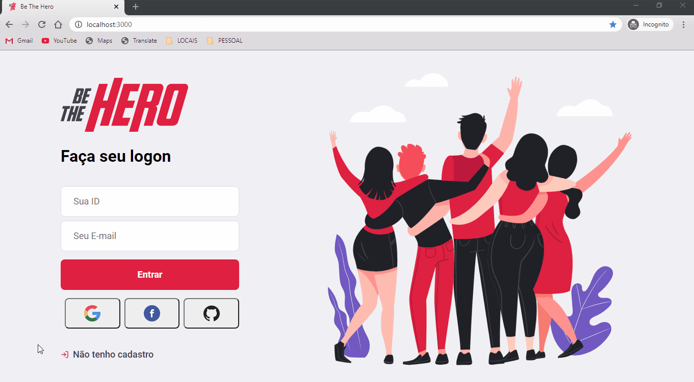
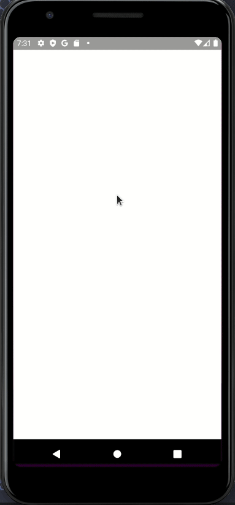

<h1 align="center">
    
</h1>

# Projeto `Be The Hero`

Aplicação com intuito de estudar Node.js, ReactJS e React Native. Abordagem utilizada no desafio da Semana OmniStack 11 da [Rocketseat](https://rocketseat.com.br/)

# Desafio proposto!

📌 Criar uma aplicação com intuito de conectar pessoas interessadas em ajudar ONGS e ANIMAIS utilizando a stack proposta ([NodeJS](https://nodejs.org/en/docs/), [ReactJS](https://reactjs.org/docs/getting-started.html) e [React Native](https://reactnative.dev/docs/getting-started) / [Expo](https://docs.expo.io/)).

## Além do desafio!

- ❌ Criar um template Dark utilizando Theme Switcher / [CSS-TRICKS](https://css-tricks.com/a-dark-mode-toggle-with-react-and-themeprovider/)
- ✔️ Criar micro-serviços no docker para facilitar a criação dos ambientes de desenvolvimento / [DEV-DOCKER](https://github.com/devluma/dev-docker)
- ✔️ Adicionar os pacotes de cada plataforma como sub-módulos do <b>GIT</b> / [GIT-SUB-MODULES](https://git-scm.com/docs/git-submodule/)
- ❌ Adicionar uma rotina para editar as <b>ONGS</b> e os <b>CASOS</b> já cadastrados
- ✔️ Adicionar um rodapé com as informações de <b>Copyright</b> da <b>Aplicação</b>
- ✔️ Adicionar <b>EditorConfig</b>, <b>Eslint</b> e <b>Prettier</b> para padronizar o código da aplicação / [Dica do DIEGO3G](https://www.youtube.com/watch?v=TI4v4Y8yRjw)
- ❌ Adicionar animações nos botões, inputs e loading dos formulários / [Dica do ARTHURPC03](https://github.com/ARTHURPC03/Be-The-Hero)
- ❌ Adicionar testes de integração e unitários ao projeto utilizando [JEST](https://jestjs.io/docs/en/getting-started) e [SQLITE](https://www.sqlite.org/docs.html)
- ❌ Adicionar <b>Login Social</b> na aplicação, utilizando mídias socias como <b>Google</b>, <b>Facebook</b> e <b>GitHub</b>
- ❌ Alterar a animação da navegação do mobile para deixá-la igual a de <b>IOS</b> / [Dica do ARTHURPC03](https://www.youtube.com/watch?v=dYRHe2Kkq04)
- ✔️ Alterar o <b>HEADER</b> da aplicação para ficar com um efeito de <b>Scroll-Over</b> ao rolar a página
- ❌ Ajustar o aplicativo web para aceitar responsividade
- ❌ Utilizar [Styled-Components](https://styled-components.com/) para estilizar as telas da aplicação
- ❌ Utilizar [@typescript](https://www.typescriptlang.org/) como superset no JavaScript
- ❌ Utilizar o [Sequelize](https://sequelize.org/) como <b>ORM na API</b>.

# 🚢 Descrição do Projeto:

### 👉 Back-end:

A <b>API RESTful</b> foi criada utilizando <b>ExpressJS</b> com <b>Knex</b> e o <b>Insomnia</b> para testar as rotas e autenticação das chamadas na <b>API</b>.

<table>
  <thead>
    <th>
      <b>Consultas no Insomnia:</b>
    </th>
  </thead>
  <tbody>
    <tr>
      <td>
        
      </td>
    </tr>
  </tbody>
</table>

### 👉 Front-end

A <b>Aplicação WEB</b> foi criada utilizando <b>ReactJS</b> com <b>CSS3</b> e <b>Axios</b> para as chamadas na <b>API</b>.

<table>
  <thead>
    <th>
      <b>Tema Normal:</b>
    </th>
  </thead>
  <tbody>
    <tr>
      <td>
        
      </td>
    </tr>
  </tbody>
</table>

<table>
  <thead>
    <th>
      <b>Tema Dark:</b>
    </th>
  </thead>
  <tbody>
    <tr>
      <td>
        
      </td>
    </tr>
  </tbody>
</table>

### 👉 Mobile

A <b>Aplicação MOBILE</b> foi criada utilizando <b>React Native</b> com <b>Expo</b> e <b>Styled-Components</b> para estilizar as telas da aplicação.

<table>
  <thead>
    <th>
      <b>Tema Normal:</b>
    </th>
    <th>
      <b>Tema Dark:</b>
    </th>
  </thead>
  <tbody>
    <tr>
      <td>
        
      </td>
      <td>
        
      </td>
    </tr>
  </tbody>
</table>

# 🚀 Tecnologia(s) Utilizada(s) no Projeto

<table>
  <thead>
    <th>Back-end</th>
    <th>Front-end</th>
    <th>Mobile</th>
  </thead>
  <tbody>
    <tr>
      <td>NodeJS</td>
      <td>ReactJS</td>
      <td>React Native - Expo</td>
    </tr>
    <tr>
      <td>ExpressJS</td>
      <td>CSS3</td>
      <td>Styled-Components</td>
    </tr>
    <tr>
      <td>SqLite</td>
      <td>Axios</td>
      <td>Axios</td>
    </tr>
    <tr>
      <td>Nodemon</td>
      <td>React Hooks</td>
      <td>React Hooks</td>
    </tr>
    <tr>
      <td>Cors</td>
      <td>Eslint</td>
      <td>Eslint</td>
    </tr>
    <tr>
      <td>Knex ou Sequelize</td>
      <td>Prettier</td>
      <td>Prettier</td>
    </tr>
    <tr>
      <td>Jest</td>
      <td>Jest</td>
      <td>Jest</td>
    </tr>
  </tbody>
  
</table>

# 👪 Contribuições

😉 Contribuições são bem-vindas!  
🌈 Sinta-se livre para abrir uma <b>ISSUE</b> ou um <b>PULL REQUEST</b> e participar do projeto como você desejar.

# 📜 Direitos e Licença

✌ Este projeto está sobre [Licença MIT](https://choosealicense.com/licenses/mit/) e foi criado por [Luiz Marcelo Schmitt](https://www.linkedin.com/in/devluma/)

# 🙌 Apoiadores

  &nbsp;&nbsp;&nbsp;&nbsp;
  
    
  
  &nbsp;&nbsp;&nbsp;&nbsp;
  
    
  

# 🔋 Status do Projeto

[![App Version][version-image]][version-url]
![Build Status][plataform-image]
[![Downloads Stats][version-download-image]][version-download]

###### 
[Voltar](#projeto-be-the-hero) ↺

[version-image]: https://img.shields.io/badge/version-0.1.0-brightgreen?style=flat-square
[version-url]: https://github.com/devluma/semana-omni-stack11/releases
[version-download-image]: https://img.shields.io/badge/download-0.1.0-blue?style=flat-square
[version-download]: https://github.com/devluma/semana-omni-stack11/archive/master.zip
[plataform-image]: https://img.shields.io/badge/plataform-API%20%7C%20WEB%20%7C%20MOBILE-lightgrey
